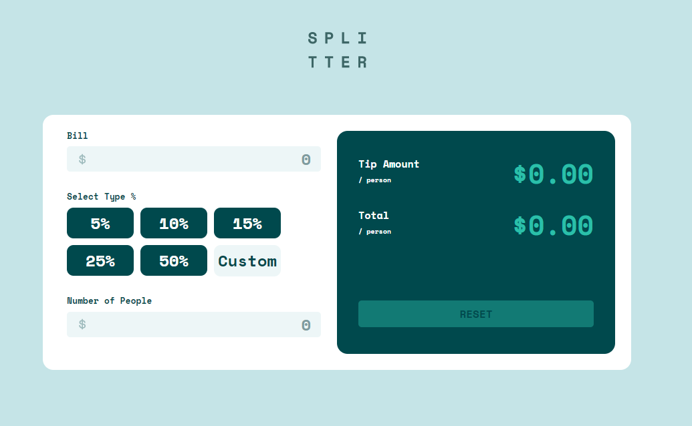

# Tip calculator app

## Table of contents

- [Overview](#overview)
  - [The challenge](#the-challenge)
  - [Screenshot](#screenshot)
  - [Links](#links)
- [Built with](#my-process)
- [Author](#author)

## Overview

### The challenge

Users should be able to:

- View the optimal layout for the app depending on their device's screen size
- See hover states for all interactive elements on the page
- Calculate the correct tip and total cost of the bill per person

### Screenshot

### Links

- Live Site URL: [Add live site URL here](https://your-live-site-url.com)

## Built with

- Semantic HTML5 markup
- CSS custom properties
- Bootstrap 5
- Javascript

## Author

- Linkedin - [Willian Henkel](https://www.linkedin.com/in/willian-henkel-b652b3205/)
- Frontend Mentor - [@HenkelDio](https://www.frontendmentor.io/profile/HenkelDio)
